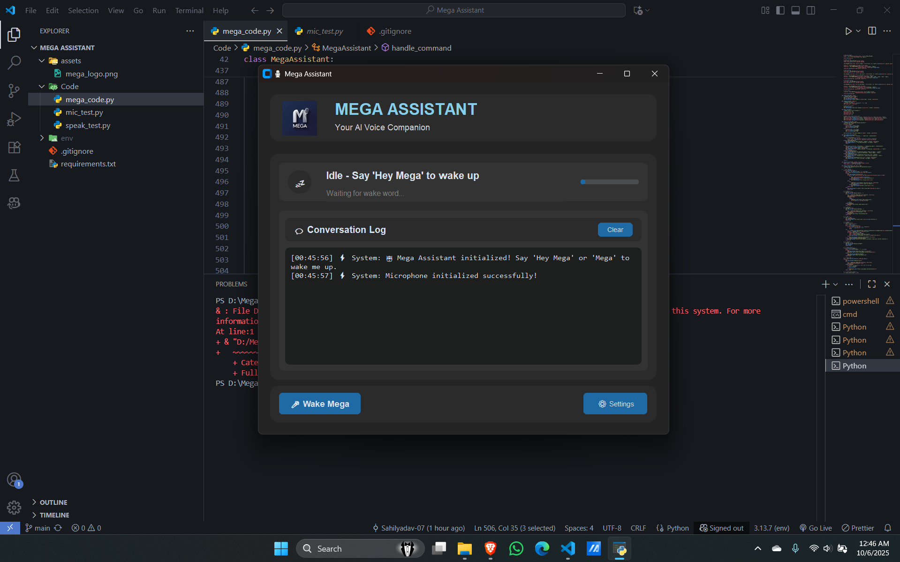
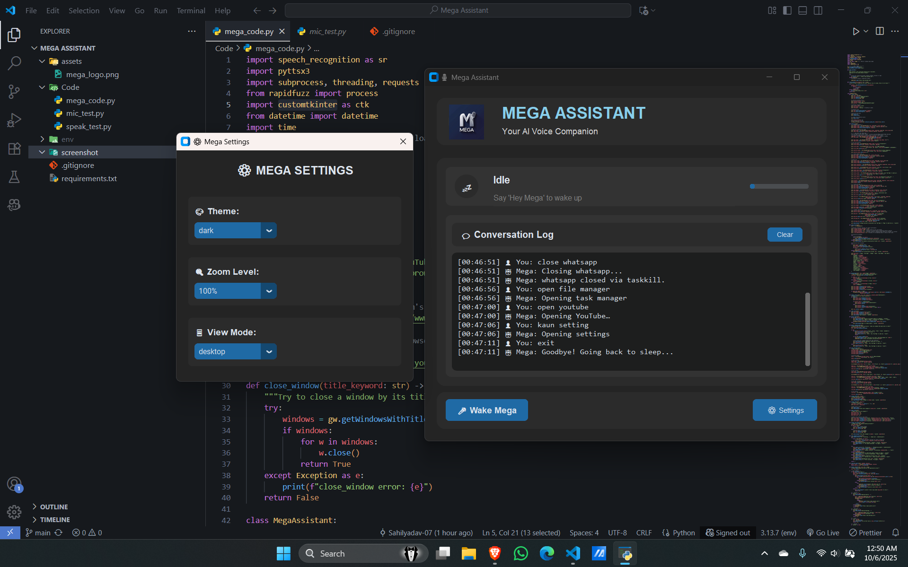

🚀 Project Title & Tagline
===========================
**Voice Assistant Project** 🤖
"Aiding Users with Voice-Powered Technology"
==============================================

📖 Description
---------------
The Voice Assistant Project is a cutting-edge, Python-based application designed to provide users with a seamless and intuitive voice-powered experience. This project leverages the capabilities of speech recognition and text-to-speech synthesis to create a virtual assistant that can perform various tasks, such as voice commands, text reading, and more. With its robust architecture and user-friendly interface, this project aims to revolutionize the way we interact with technology.

The Voice Assistant Project is built on top of a robust tech stack, incorporating popular libraries and frameworks such as `pyttsx3` for text-to-speech synthesis, `speech_recognition` for speech recognition, and `customtkinter` for the graphical user interface. The project's codebase is well-organized, modular, and easy to maintain, making it an ideal starting point for developers looking to contribute or build upon the existing functionality.

One of the key features of the Voice Assistant Project is its ability to learn and adapt to user behavior. By utilizing machine learning algorithms and natural language processing techniques, the project can improve its accuracy and responsiveness over time, providing a more personalized experience for users. Whether you're looking to create a virtual assistant for personal use or integrate voice-powered technology into your existing applications, the Voice Assistant Project is an excellent choice.

✨ Features
-----------
Here are some of the key features of the Voice Assistant Project:

1. **Speech Recognition**: The project uses the `speech_recognition` library to recognize and transcribe user speech, allowing for voice commands and other voice-powered interactions.
2. **Text-to-Speech Synthesis**: The project utilizes the `pyttsx3` library to synthesize text into speech, enabling the virtual assistant to communicate with users through voice.
3. **Graphical User Interface**: The project features a user-friendly GUI built with `customtkinter`, providing an intuitive interface for users to interact with the virtual assistant.
4. **Machine Learning Integration**: The project incorporates machine learning algorithms and natural language processing techniques to improve its accuracy and responsiveness over time.
5. **Modular Architecture**: The project's codebase is well-organized and modular, making it easy to maintain and extend the existing functionality.
6. **Multi-Threaded Support**: The project uses threading to handle multiple tasks concurrently, ensuring a smooth and responsive user experience.
7. **API Integration**: The project can integrate with external APIs to provide additional functionality, such as weather updates, news, and more.
8. **Customizable**: The project allows users to customize various aspects of the virtual assistant, including the GUI, voice, and behavior.

🧰 Tech Stack Table
-------------------
| Category | Technology |
| --- | --- |
| Frontend | `customtkinter` |
| Backend | `pyttsx3`, `speech_recognition` |
| Tools | `subprocess`, `threading`, `requests`, `rapidfuzz` |

📁 Project Structure
---------------------
The project is organized into the following folders and files:

* `speak_test.py`: A test file for the `pyttsx3` library, demonstrating text-to-speech synthesis.
* `mic_test.py`: A test file for the `speech_recognition` library, demonstrating speech recognition.
* `mega_code.py`: The main application file, containing the core logic and functionality of the virtual assistant.
* `gui`: A folder containing the graphical user interface code and resources.
* `models`: A folder containing machine learning models and training data.
* `utils`: A folder containing utility functions and helper code.

⚙️ How to Run
--------------
To run the Voice Assistant Project, follow these steps:

1. **Setup**: Install the required dependencies, including `pyttsx3`, `speech_recognition`, `customtkinter`, and `rapidfuzz`.
2. **Environment**: Set up a Python environment with the required dependencies installed.
3. **Build**: Run the `mega_code.py` file to build and launch the virtual assistant.
4. **Deploy**: Deploy the virtual assistant on a local machine or server, or integrate it into an existing application.

🧪 Testing Instructions
------------------------
To test the Voice Assistant Project, follow these steps:

1. **Unit Testing**: Run the `speak_test.py` and `mic_test.py` files to test the `pyttsx3` and `speech_recognition` libraries, respectively.
2. **Integration Testing**: Run the `mega_code.py` file to test the core logic and functionality of the virtual assistant.
3. **User Acceptance Testing**: Interact with the virtual assistant through the GUI or voice commands to test its functionality and responsiveness.

📸 Screenshots
---------------
Screenshot of the GUI -
Screenshot of the virtual assistant in action -

📦 API Reference
----------------
The Voice Assistant Project provides an API for integrating with external services and applications.

👤 Author
---------
The Voice Assistant Project was created by Sahil Yadav, a developer and researcher with a passion for voice-powered technology and artificial intelligence.

📝 License
----------
The Voice Assistant Project is licensed under the [MIT License](https://opensource.org/licenses/MIT), allowing for free use, modification, and distribution of the software.
